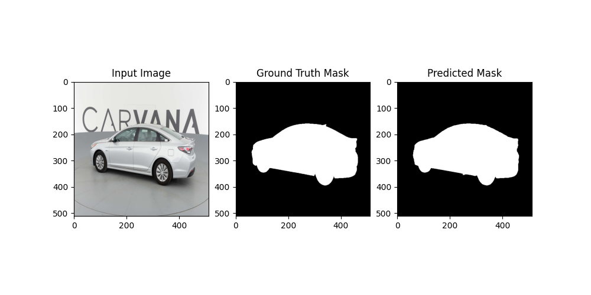

## U-NET - Image Segmentation Carvana

   

---

End-to-end **image segmentation** project using a **U-Net architecture** implemented from scratch in **PyTorch**, trained on the **Carvana Image Masking Challenge** dataset (Kaggle).

The goal is to automatically segment the **car (foreground)** from the **background** in RGB images.


---

## Project Motivation

This project was developed as a **learning-oriented, hands-on Deep Learning project**, with the objective of **continuing to expand my knowledge of neural networks and computer vision** while working on a realistic, non-trivial task.

The main goals were:

- Deepen understanding of **convolutional neural networks (CNNs)**
- Implement an **encoder–decoder architecture (U-Net)** from scratch
- Work with **larger image segmentation datasets**
- Train models under **real-world hardware constraints**
- Build a complete pipeline: **training → inference → visualization**

The focus was not on achieving state-of-the-art performance, but on **clean implementation, reproducibility, and learning through practice**.

---


## Model Architecture: U-Net

A **classic U-Net architecture** is used, widely adopted for semantic segmentation tasks.

Key characteristics:
- Symmetric **encoder–decoder** structure
- **Skip connections** between encoder and decoder
- 2D convolutions with ReLU activations
- Binary segmentation output (foreground / background)

Implementation can be found in: `uNetUtils.py`

<p align = "center">
    
</p>


---

## Repo Structure

```
.
├── inference.py
├── trainuNet.py
├── uNetUtils.py
├── requirements.txt
├── resources/
│   └── inference_result.png
├── .gitignore
└── README.md

```

---

## Dataset 


This project uses the Carvana Image Masking Challenge dataset from Kaggle.

- RGB car images

- Binary segmentation masks

- Medium dataset (not included in the repository)

**Dataset** link:
https://www.kaggle.com/competitions/carvana-image-masking-challenge/data

```The dataset/ directory is excluded from the repository via .gitignore due to its size.```

---

## Setup & Installation

It is recommended to use a Python virtual environment.

The virtual environment itself is not included in the repository.

Install the required dependencies using:

``` $ pip install -r requirements.txt```

**Remember this setup was created on a linux(ubuntu) venv with python 3.12*

--- 

## Training
Model training is performed using ```trainuNet.py```

Command: 

``` $ python trainuNet.py --epochs 10 --batchsize 2 --lr 1e-4 ```
```
--epochs     Number of training epochs
--batchsize  Batch size (depends on GPU VRAM)
--lr         Initial learning rate
--stepsize   Step size for learning rate scheduler 
```

#### Hardware constraints and training choices

Training was performed on local hardware:

- **GPU**: NVIDIA GTX 1650 Ti (Laptop) 4GB VRAM

- **OS**: Linux

Due to these limitations:

- A s**mall batch size (2)** was required

- Training was limited to **10 epochs**

- Total training time ≈ **3.5 hours**

*These parameters were chosen to ensure training stability and avoid out-of-memory errors.*

---

## Inference 

To visualize model performance you can run:
``` $ python inference.py ```


The script:

- Loads the trained ```.pth``` model

- Runs inference on a sample from the dataset

- Saves a visualization containing:

    - Original image

    - Ground truth mask

    - Model prediction

#### Inference example

<p align = "center ">
    
</p>


--- 

## Conclusions &  Improvements


- A complete U-Net-based image segmentation pipeline was successfully implemented using PyTorch
- The project served as a **hands-on learning exercise** to deepen understanding of convolutional neural networks and encoder–decoder architectures
- While better segmentation performance could likely be achieved with:
  - More training epochs
  - Larger batch sizes
  - More extensive experimentation  
  these options were limited by **hardware constraints (4 GB VRAM)** and **training time**


- Given that the primary goal was **learning and architectural understanding**, further optimization was not strictly necessary for the scope of this project
- The project reflects realistic engineering trade-offs between performance, resources, and development time

- Train for a higher number of epochs using more powerful hardware
- Increase batch size to improve gradient stability
- Use **Dice Loss / IoU-based losses** tailored for segmentation tasks
- Apply data augmentation techniques to improve generalization
- Experiment with mixed-precision training (FP16)

---

## References 

- Carvana Image Masking Challenge (Kaggle): 
https://www.kaggle.com/competitions/carvana-image-masking-challenge/data
- U-Net: Convolutional Networks for Biomedical Image Segmentation:
https://arxiv.org/pdf/1505.04597
- Pytorch documentation: 
https://docs.pytorch.org/docs/stable/index.html